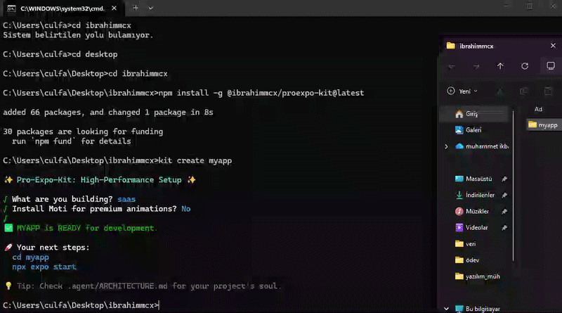

# 🚀 Pro-Expo-Kit


> You don’t just create an Expo app.
> You build it the **right way**.

---

## 🎬 Demo



---

## 🧠 What is Pro-Expo-Kit?

**Pro-Expo-Kit** is an AI-powered CLI that transforms your Expo workflow into a **production-ready system in minutes**.

Built specifically for **Expo SDK 54**, it eliminates setup complexity and enforces **real-world best practices** from the very first command.

---

## ⚡ Why Developers Love It

* 🧠 Thinks like a senior developer
* ⚙️ Creates production-ready architecture automatically
* 💥 One command = full feature system
* 👨‍⚕️ Detects & fixes problems instantly
* 🤖 Generates real code using AI
* 🚫 Fully **Reanimated-free architecture**

---

## 🚀 Installation

```bash
npm install -g @ibrahimmcx/proexpo-kit
```

---

## ⚡ Quick Start

```bash
kit create myApp
cd myApp
npm start
```

---

## 🏗️ Smart Project Wizard

```bash
kit create myApp
```

✨ Interactive setup options:

* SaaS App
* AI App
* Social App
* E-commerce App

👉 Automatically sets up:

* Clean folder structure
* Navigation system
* Scalable architecture
* Required dependencies

---

## 💥 1 Command = Feature

```bash
kit add auth
```

Instantly injects:

* 🔐 Login & Register screens
* 🧠 AuthContext + custom hooks
* 🔑 Token management system
* 🔄 Navigation integration
* 💾 AsyncStorage setup

---

## 👨‍⚕️ Doctor (Auto-Fix System)

```bash
kit doctor
```

✔️ Checks Expo SDK 54 compatibility
✔️ Detects dependency issues
✔️ Automatically fixes common errors
✔️ Removes forbidden packages (Reanimated)

---

## ⚡ Performance Optimization

```bash
kit optimize
```

✔️ Detects large assets
✔️ Finds unused dependencies
✔️ Identifies performance bottlenecks

---

## 🧠 AI Code Generation

```bash
kit ai "modern login screen with dark theme"
```

✔️ Generates SDK 54 compliant code
✔️ Follows Pro-Expo architecture
✔️ Writes directly into your project

---

## 🏥 Advanced Health Check

```bash
kit check
```

✔️ Node.js compatibility
✔️ SDK 54 validation
✔️ Project structure verification

---

## 📂 Project Scaffolding

```bash
kit scaffold
```

✔️ Creates professional folder structure
✔️ Applies best practices instantly

---

## 🏷️ Smart Knowledge Archive

```bash
kit archive "Fix Navigation Bug" "Solution details..."
```

✔️ Save reusable solutions
✔️ Build your own developer knowledge base

---

## 🔐 API Key Setup

```bash
kit set-key YOUR_API_KEY
```

✔️ Secure AI integration
✔️ Ready-to-use Gemini support

---

## 🧱 Built With Real-World Standards

* Clean Architecture
* Custom Hooks Pattern
* API Layer Separation
* Theme System
* Scalable Folder Structure

---

## 🎯 Philosophy

> Developers shouldn’t waste time fixing setup issues.
> They should focus on building real products.

---

## 🔥 What Makes It Different?

Most tools:

* Create a project ❌
* Install a few packages ❌

**Pro-Expo-Kit:**

* Builds a real architecture ✅
* Injects full features ✅
* Fixes itself automatically ✅
* Writes code for you ✅

---

## 🚀 Vision

Pro-Expo-Kit is not just a starter tool.

It’s a **developer accelerator** designed to turn ideas into production-ready apps — faster than ever.

---

## ⚖️ License

MIT © ibrahimmcx
